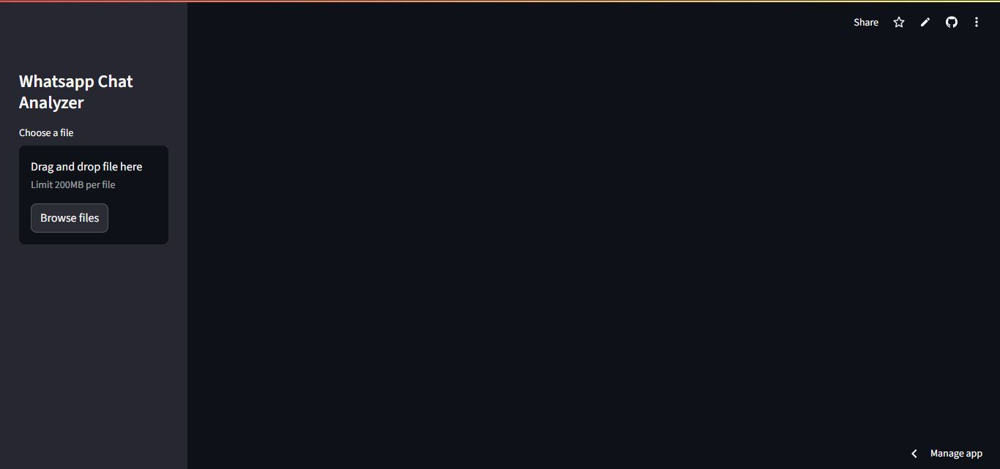

# WhatsApp Chat Analysis 📊 [🔗 Live App]https://whatsappchatanalysis01.streamlit.app/


A **Streamlit-based web app** to analyze and visualize your **WhatsApp chat data** in a meaningful and interactive way.

## 🔥 Key Features:
- 📅 **Group and Individual Chat Analysis**
- 📈 **Monthly / Weekly / Daily / Hourly Statistics**
- 💬 **Most Active Users**
- 😆 **Emoji Usage Analysis**
- 📝 **Wordcloud of Most Used Words**
- 🧑‍💻 **Busiest Day / Time Analysis**
- 🕵️ **Message Timeline Visualizations**

---

## 🚀 How to Run the App:
1️⃣ Clone the repository:
```bash
git clone https://github.com/Codeabhi096/Whatsapp_chat_Analysis.git
cd Whatsapp_chat_Analysis
````

2️⃣ Install dependencies:

```bash
pip install -r requirements.txt
```

3️⃣ Run the app:

```bash
streamlit run app.py
```

---

## 📸 App Screenshot:




---

## 📂 Folder Structure:

```
Whatsapp_chat_Analysis/
│
├── app.py
├── helper.py
├── preprocessor.py
├── requirements.txt
├── README.md
├── screenshot.png
├── .gitignore
└── env/ (Virtual Environment)
```

---

## ⚙️ Technologies Used:

* **Python**
* **Streamlit**
* **Pandas**
* **Matplotlib / Seaborn**
* **Wordcloud**
* **Emoji Analysis Libraries**

---

## 🤝 Contribution:

Feel free to fork this repo and create Pull Requests!
If you like this project, **give it a ⭐ on GitHub.**

---

## 📬 Contact:

For any queries, feel free to reach out on [LinkedIn](https://www.linkedin.com/in/abhishekbhardwaj01/).

---
